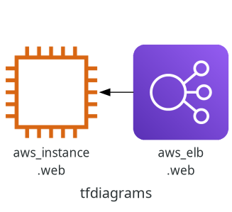

# tfdiagrams

Generate Diagram from terraform output.



## Usage (CLI):

```bash
tdot [ flags ] [ input file path ]
# terraform graph | tfdot -ograph.png
```

If no input files are supplied, the program reads from **stdin**.

### Install packages

```bash
$ pip install tfdiagrams
```

### Flags

**-T***format*  
Set output language to one of the supported formats. By default, png image is produced.

**-o***outfile*  
Write output to file outfile.

**-e***keyword,comma,separated*  
Exclude keywords separated by commas

## Usage (docker):
```bash
docker run --rm -it \
  --workdir=/app \
  -v "$PWD:/app" \
  semnil/tfdiagrams sh -c "terraform init && terraform graph | tfdot -ograph.png"
```
